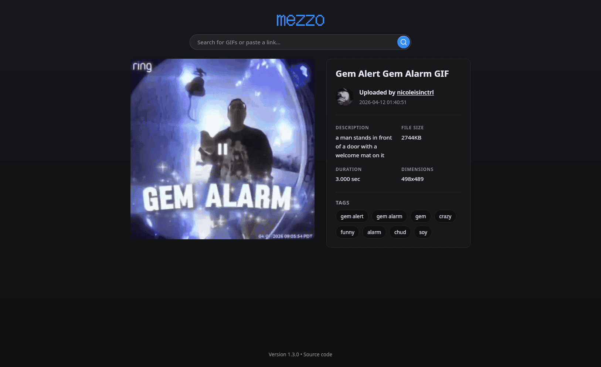
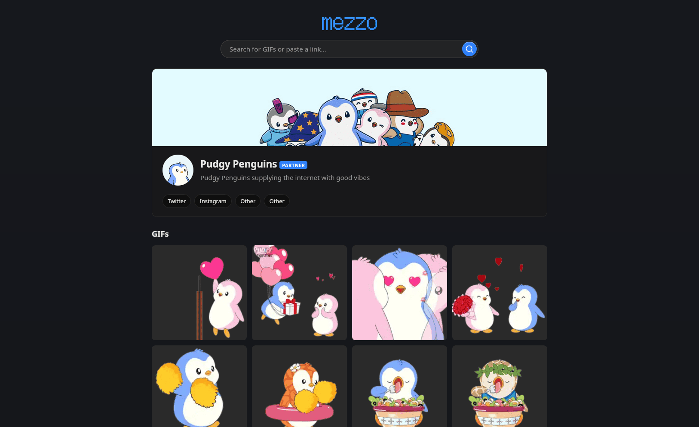
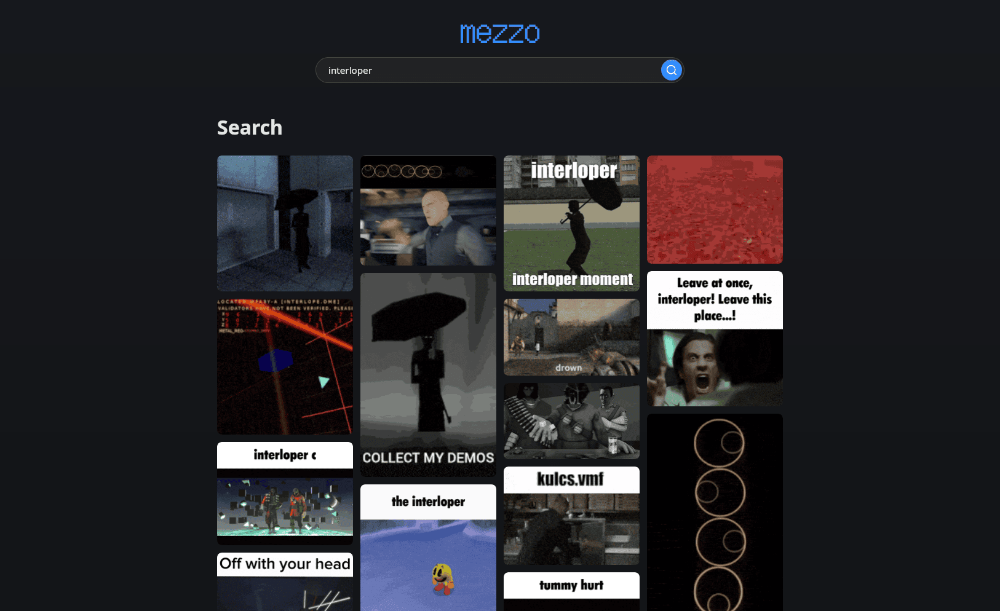

# Mezzo
Mezzo is an open-source, privacy-focused front-end for Tenor that allows you to browse and view GIFs without Google's tracking and advertising systems.

<details>
<summary>Click to see screenshots</summary>


*Showcase of the GIF view page*


*Showcase of the user profile page*


*Showcase of the search page*

</details>

# Instances
For public instances of Mezzo, see [mezzo-instances](https://foundry.fsky.io/fsky/mezzo-instances).

# Run your own instance

## With Docker/Podman
We have pre-built images you can run.

To run the latest stable version of Mezzo (recommended):

```bash
docker run -p8006:8006 foundry.fsky.io/fsky/mezzo:latest
```

To run the canary (unstable) version of Mezzo built from the latest Git commit:

```bash
docker run -p8006:8006 foundry.fsky.io/fsky/mezzo:canary
```

If you are using Podman, the process is the same. Just replace `docker` with `podman` in the command.

### Compose
You can find a compose file in [`contrib/compose/compose.yaml`](contrib/compose/compose.yaml). Simply download it and run:

```
docker compose up -d
```

### Quadlet
You can find a Quadlet file in [`contrib/quadlet/mezzo.container`](contrib/quadlet/mezzo.container). Download it and place it into `~/.config/containers/systemd/` or `/etc/containers/systemd/`. After that, run:

```
systemctl --user daemon-reload
systemctl --user start mezzo.service
```

## From a binary
Binaries are provided for Linux, Windows, macOS, FreeBSD, OpenBSD, NetBSD, and Illumos for amd64, arm64, and i386. You can download them from the [releases page](https://foundry.fsky.io/fsky/mezzo/releases).

Once downloaded, run the binary directly. On Unix-like systems you may need to mark it as executable first:

```bash
chmod +x mezzo
```

## Linux packages
Linux packages are also published for Debian/Ubuntu (`.deb`), RPM-based distributions (`.rpm`), and Arch Linux (`.pkg.tar.zst`).

The packages install:
- the `mezzo` binary into `/usr/bin`
- a systemd service unit
- a distro-appropriate environment file:
  `/etc/default/mezzo` on Debian
  `/etc/sysconfig/mezzo` on RPM-based systems
  `/etc/conf.d/mezzo` on Arch Linux

After installation, edit the environment file if needed, then enable the service:

```bash
sudo systemctl enable --now mezzo
```

### Running with systemd or other service managers
For systemd, you can find an example service file in [`contrib/systemd/mezzo.service`](contrib/systemd/mezzo.service).

For OpenRC, you can find an example service script and configuration file in [`contrib/openrc/`](contrib/openrc/).

## Build from source
This program is written in Go. You need Go 1.25 or later.

You can build a binary using:
```bash
go build -o mezzo ./cmd/mezzo
```

# Configuration
The application can be configured using the following environment variables:

| Variable | Required | Default | Description |
|----------|----------|---------|-------------|
| `MEZZO_PORT` | No | `8006` | Port to run on. |
| `MEZZO_PATCHES_URL` | No | | Link to any patches that were applied. Only set this if your instance runs modified source code. |
| `MEZZO_CACHE_DISABLED` | No | `false` | Disable in-memory caching entirely. |
| `MEZZO_CACHE_GIF_TTL` | No | `1h` | How long to cache GIF page metadata. Accepts Go duration strings (e.g. `30m`, `2h`). |
| `MEZZO_CACHE_GIF_MAX` | No | `1000` | Maximum number of GIF pages to keep in cache. |
| `MEZZO_CACHE_SEARCH_TTL` | No | `10m` | How long to cache search results. Accepts Go duration strings. |
| `MEZZO_CACHE_SEARCH_MAX` | No | `500` | Maximum number of search result pages to keep in cache. |
| `MEZZO_CACHE_PROFILE_TTL` | No | `30m` | How long to cache user profile pages. Accepts Go duration strings. |
| `MEZZO_CACHE_PROFILE_MAX` | No | `200` | Maximum number of user profiles to keep in cache. |

> [!NOTE]
> For backward compatibility, `PORT` and `PATCHES_URL` (without the `MEZZO_` prefix) are still accepted as fallbacks.

# License
Copyright © 2026-present FSKY. This software is distributed under the [AGPL-3.0 license](LICENSE).
